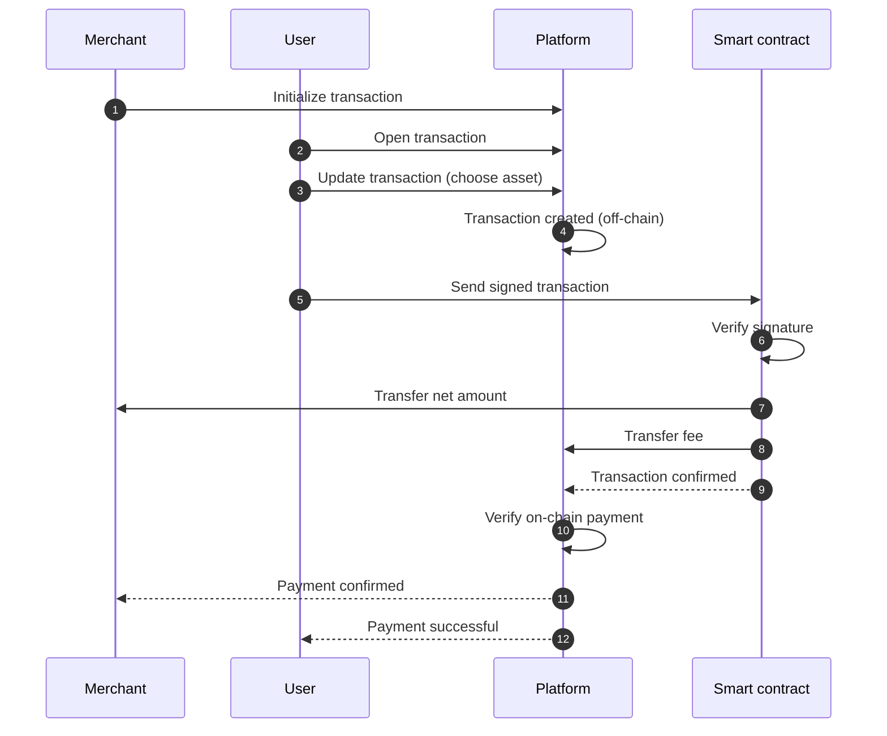

# Shreeed, a non-custodial crypto payment gateway

**_Pronounced "shreed" — `/ʃriːd/`._**

> Shreeed the cost.

_Non-custodial refers to a system architecture in which the protocol never takes possession, control, or discretionary authority over users' funds at any point in the transaction lifecycle._

## Overview

Shreeed is an open-source cryptocurrency payment gateway designed to achieve a high degree of decentralization in its transaction model while ensuring full transparency. The proposed infrastructure enables merchants to accept cryptocurrency payments directly into their own wallets without relinquishing custody of their funds or relying on trusted intermediaries.

The platform functions as a transparent routing layer that facilitates transactions and applies a predefined service fee, while never exercising control over the complete payment flow. Built for emerging Web3 commerce paradigms, the system leverages on-chain transparency, smart contract automation, and multi-chain interoperability to provide a trust-minimized, verifiable, and non-custodial payment solution.

## Current development status

| Category        | Task                                             | Status |
| --------------- | ------------------------------------------------ | ------ |
| Smart contracts | Create smart contracts for main blockchains      | 🟩     |
| Smart contracts | Audit smart contracts                            | 🟥     |
| Smart contracts | Deploy smart contracts to test networks          | 🟥     |
| Smart contracts | Deploy smart contracts to main networks          | 🟥     |
| Platform        | Frontend application for merchants               | 🟥     |
| Platform        | Frontend website for merchants and users         | 🟥     |
| Platform        | Backend services for transaction management      | 🟥     |
| Platform        | Integration with smart contracts                 | 🟥     |
| Cryptography    | Multi-party computation for off-chain signatures | 🟧     |
| Documentation   |                                                  | 🟥     |

## Goals and non-goals

### Goals

- Enable merchants to accept crypto payments directly into their own wallets
- Ensure full on-chain transparency and verifiability
- Minimize trust assumptions toward the platform
- Support multi-chain deployments
- Remain open-source as much as possible

### Non-goals

- Custody of user or merchant funds
- Fiat on/off ramps
- User wallet management
- Transaction censorship or reversibility

## Architecture overview

The system is composed of four main layers:

1. **Merchant layer**
   - Merchant-owned wallets
   - Merchant frontend integration

2. **User layer**
   - User wallets (EOA or smart wallets)
   - User signs transactions client-side

3. **Platform layer (off-chain)**
   - Transaction initialization
   - Off-chain signature generation
   - Transaction monitoring
   - No private key custody

4. **On-chain layer**
   - Smart contracts enforcing:
     - Signature validation
     - Fee extraction
     - Direct settlement to merchant

## Trust assumptions

- The platform cannot move funds arbitrarily
- Merchants trust the smart contracts, not the platform backend
- Users trust their wallet software
- Smart contracts are immutable once deployed

## Threat model

**Considered threats:**

- Platform attempting to redirect funds
- Replay attacks
- Fee manipulation
- Invalid or forged signatures
- Frontend compromise

**Out of scope:**

- Wallet-level compromises
- Chain-level reorgs

## Simplified transaction flow

This diagram presents a simplified overview of the transaction flow between the merchant, the user, the platform, and the smart contracts. It intentionally omits the off-chain processes performed by the platform to create and manage transactions, including the generation of tamper-resistant off-chain signatures, the storage of transaction metadata, and the monitoring of on-chain execution status.

## Security and on-chain transparency

All transactions are immutably recorded on-chain, ensuring full verifiability and transparency, while the platform itself never holds private keys or assumes custody of user funds. The payment gateway is implemented through open-source smart contracts developed and maintained by the same entity responsible for the platform, and these contracts are subject to independent security audits prior to mainnet deployment, thereby reducing trust assumptions while mitigating implementation and operational risks.

## Disclaimer

This software is provided "as is", without warranty of any kind. This project does not provide financial, legal, or regulatory advice.

## License

Certain components of this project are licensed under the [MIT License](LICENSE), allowing free use, modification, and contribution in accordance with its terms.
