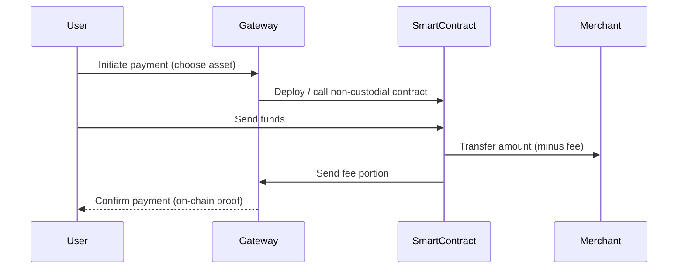

# Non-Custodial Cryptocurrency Payment Gateway

A decentralized and fully transparent crypto payment gateway - enabling merchants to receive payments directly, without ever giving up custody of their funds.

## Overview

This payment gateway is an open-source payment infrastructure that allows merchants to accept cryptocurrency payments **without trusting a third party**.  
Our platform acts as a **transparent routing layer**, facilitating the transaction and taking a **small service fee**, but **never controlling the full funds**.  
Built for the **next generation of Web3 commerce**, it combines **on-chain transparency**, **smart contracts**, and **multi-chain interoperability**.  

## Transaction Flow

## Security and Transparency

All transactions are recorded on-chain, and the platform never holds private keys or user funds.  
Smart contracts will be open-source and audited before mainnet deployment.  

## License

This project is licensed under the [MIT License](LICENSE) - free to use, modify, and contribute.

_Built with ❤️ in France_
